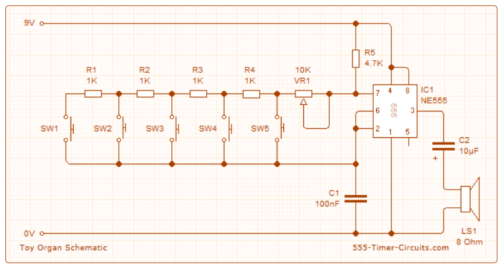
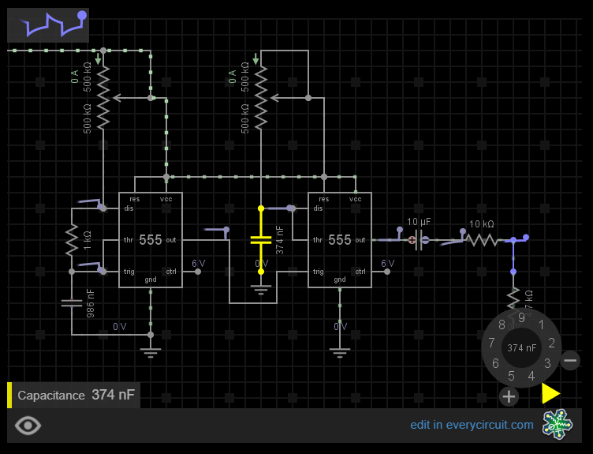
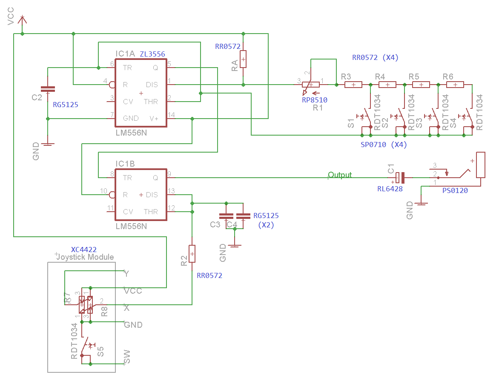
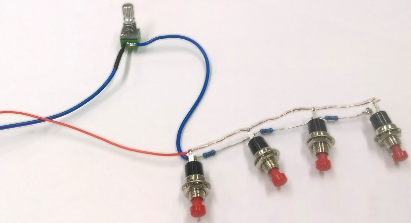

# Atari Punk Synth

Make your next album with our next generation music maker device! Using simple electronic components, we have copied the original and well known Atari Punk Console synthesizer to make this unique "cheap-box" musical synth. With 4 buttons and a joystick ( which acts like a whammy bar) you can now create your own "daft-punk" styled album. No musical talent required!

## Bill of Materials

|Qty| Code | Description |
|---|---|---|
|1 | [HB5610](http://jaycar.com.au/p/HB5610) | Black remote enclosure
|2 | [SB2300](http://jaycar.com.au/p/SB2300) | rechargeable LiPo AAA-sized battery
|1 | [XC4422](http://jaycar.com.au/p/XC4422) | XY Joystick Module
|1 | [XC3850](http://jaycar.com.au/p/XC3850) | Prototyping shield
|1 | [RP8510](http://jaycar.com.au/p/RP8510) | 10k 9mm potentiometer
|1 | [PS0120](http://jaycar.com.au/p/PS0120) | 3.5mm socket
|4 | [SP0710](http://jaycar.com.au/p/SP0710) | Red miniature push button
|1 | [ZL3556](http://jaycar.com.au/p/ZL3556) | Dual 555 Timer
|3 | [RG5125](http://jaycar.com.au/p/RG5125) | 100nF poly cap
|1 | [RL6428](http://jaycar.com.au/p/RL6428) | 10uF electrolytic cap
|1 | [RR0572](http://jaycar.com.au/p/RR0572) | pack of 8, 1k resistors.

## Connections

This unit is essentially a "555 Toy Organ" circuit placed ontop of the traditional Atari Punk Console circuit, with some values selected to suit with the [XC4422](https://jaycar.com.au/p/XC4422) Joystick module.

The two schematics that we are putting together are below as reference:

The next schematic is for the Atari punk console, but has been taken from an online simulator that is very helpful in understanding how the values of the passive components around the Atari punk console change the effects:

The simulator can be found at [Every Circuit](http://everycircuit.com/circuit/6598696118517760/atari-punk-console---dual-555), You'll also find APC circuit diagrams all around the internet, and many people have tried their own approach to doing it.

Our end result looks like this:

You can easily see how the toy organ influences the design.

## Assembly.

First task is to assemble the button configurations, these are fairly easy as you're making a bit of a ladder design across all the buttons. Make sure that all of the resistors are on one side of the buttons, and the other side is all joined up, then put the potentiometer on one end of the wire, like the below picture.

