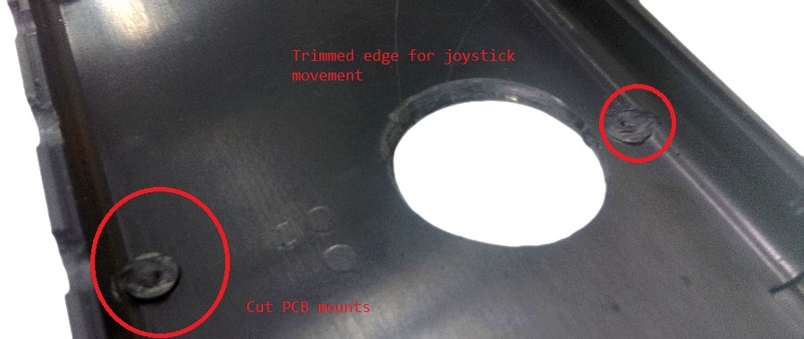
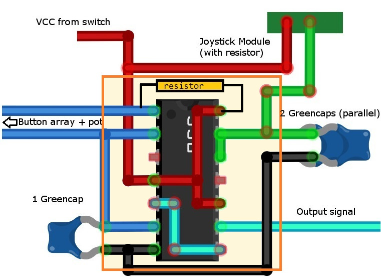

# Atari Punk Synth

Make your next album with our next generation music maker device! Using simple electronic components, we have copied the original and well known Atari Punk Console synthesizer to make this unique "cheap-box" musical synth. With 4 buttons and a joystick ( which acts like a whammy bar) you can now create your own "daft-punk" styled album. No musical talent required!

## Bill of Materials

|Qty| Code | Description |
|---|---|---|
|1 | [HB5610](http://jaycar.com.au/p/HB5610) | Black remote enclosure
|2 | [SB2300](http://jaycar.com.au/p/SB2300) | rechargeable LiPo AA-sized battery
|1 | [XC4422](http://jaycar.com.au/p/XC4422) | XY Joystick Module
|1 | [XC3850](http://jaycar.com.au/p/XC3850) | Prototyping shield
|1 | [RP8510](http://jaycar.com.au/p/RP8510) | 10k 9mm potentiometer
|1 | [PS0120](http://jaycar.com.au/p/PS0120) | 3.5mm socket
|4 | [SP0710](http://jaycar.com.au/p/SP0710) | Red miniature push button
|1 | [ZL3556](http://jaycar.com.au/p/ZL3556) | Dual 555 Timer
|3 | [RG5125](http://jaycar.com.au/p/RG5125) | 100nF poly cap
|1 | [RL6428](http://jaycar.com.au/p/RL6428) | 10uF electrolytic cap
|1 | [RR0572](http://jaycar.com.au/p/RR0572) | pack of 8, 1k resistors.

* If you're picking this up at the store, be sure to grab a matching nut to fit onto the potentiometer and mount securely.

## Connections

This unit is essentially a "555 Toy Organ" circuit placed ontop of the traditional Atari Punk Console circuit, with some values selected to suit with the [XC4422](https://jaycar.com.au/p/XC4422) Joystick module.

The two schematics that we are putting together are below as reference:

The next schematic is for the Atari punk console, but has been taken from an online simulator that is very helpful in understanding how the values of the passive components around the Atari punk console change the effects:

The simulator can be found at [Every Circuit](http://everycircuit.com/circuit/6598696118517760/atari-punk-console---dual-555), You'll also find APC circuit diagrams all around the internet, and many people have tried their own approach to doing it.

Our end result looks like this:

You can easily see how the toy organ influences the design.

## Assembly

Below are some sections of the build. You can see that we've used heat shrink for some joins, which isn't entirely needed but it is a good idea in small spaces, as accidental shorts can sometimes be hard to find and will stop the audio from coming through completely.

#### Buttons

First task is to assemble the button configurations, these are fairly easy as you're making a bit of a ladder design across all the buttons. Make sure that all of the resistors are on one side of the buttons, and the other side is all joined up, then put the potentiometer on one end of the wire, like the below picture.

In the schematic, I have one extra resistor (`R3`) that can be put anywhere along this loop, as it is unaffected by the buttons, and will help give the noise a higher-pitched sound.

#### Output socket

We can also set the electrolytic pot (RL6428) close to the socket and solder it in place, so that the negative strip is the final output to the phones, and ground the other side.

#### Joystick Module

The Joystick module is easy enough to do, as there's only one in and out going through the device. Simply add one resistor inline with one of the X or Y outputs, and solder a wire on +5V / VCC.

The internal workings of the joystick allows for some interesting type of configurations. For instance, it would be possible to allow both the X and Y directions to modify different aspects of the synth, but for now we'll only use the X direction.

#### Drilling out the case

The case is matter of preference, as to where exactly you want the buttons, but a good way of laying out the positioning is by placing the case in your hand and marking with a pencil where the drill holes should go.

The joystick hole is a 23mm diameter hole, about 51mm up and 13mm in from the outside bevel lower edge, like below.

Put the two halves of the case together and drill 7mm holes along where the buttons are meant to go. Having the two halves together helps with drilling out both sides evenly and the buttons line up along the middle of the case.

It might also be helpful to trim the underside edge of the joystick cutout, and to cut away the PCB mounts (as we are not using them to support our PCBs.) Check the fit of the joystick mounting below before trimming away too much of the joystick cutout. The aim is to have the joystick move freely but not provide a massive gap into the case.

#### PCB soldering

The general layout for the PCB, according to the schematic above, looks something like this:

Anything not immediately close to the chip is on a set of wires, as the prototyping PCB board we have is fairly small. There's a resister bridging over the top of the chip, that pulls pin 1 high, so we bridge it over to pin 14, which is the chip VCC.

There's a few connections that connect to both sides of the chip, such as the line going from pin `5 to 8`, and the `4-10-14` connections. These are best done on the reverse side of the PCB (Remember, *reverse*, double check pin layouts.)

Here is a picture of our board once we soldered it together and wired it up

Notice the orientation on the board and the chip. Due to the size of it being so small and tight, it's difficult to show the layout on the physical board.

#### Layout and positioning

The only bit of importance in positioning the parts inside the unit, is the position of the joystick. We've found the best way to position it is to (firstly, snip any pcb mounts in the way, then) place the corner of the joystick module so it sits just flush near the battery component tab. Make sure that you do leave plenty of room for the battery tab to slide in and out.

Hot glue that in and make sure that the top case fits over, so the joystick cut out has plenty of room to move around freely.

## Final pieces

Now to finish the build, the only remaining piece is the front plate.

You must be very slow and careful in drilling out the top plate. It works out more reliable if you drill a small hole and file it out bigger, rather than using a bigger drill and breaking the piece in half.

Remember too that the output jack has a capacitor on it, and the pot is meant to have a knob on it, so you should leave room for both of these.

Most of the room was taken by the capacitor on the inside, if this was rearranged differently then you could position the panel with more equal spacing.

## Layout

The final layout should look something like below. Notice the battery leads going to the switch for postitive and to the board for negative; We then make sure all the clerances are correct and close the unit, screwing it together.

Put the batteries into the unit and connect up a speaker system on **low** volume. The device can be loud to start off with, so make sure you start up low and move upwards.

You should be able to hear all sorts of buzzes and beeps when you press on the 4 buttons. Tune the entire device with the top knob, and module the sound with the joystick whammy bar.

## Future improvements

Consider this just getting your feet wet, as there is millions of different audio circuits out there for all sorts of difficulty levels. We might be looking at more circuits in the future, so if you have built this and enjoyed the unit, be sure to take a picture or make a video of you jamming out and post it on our facebook.
